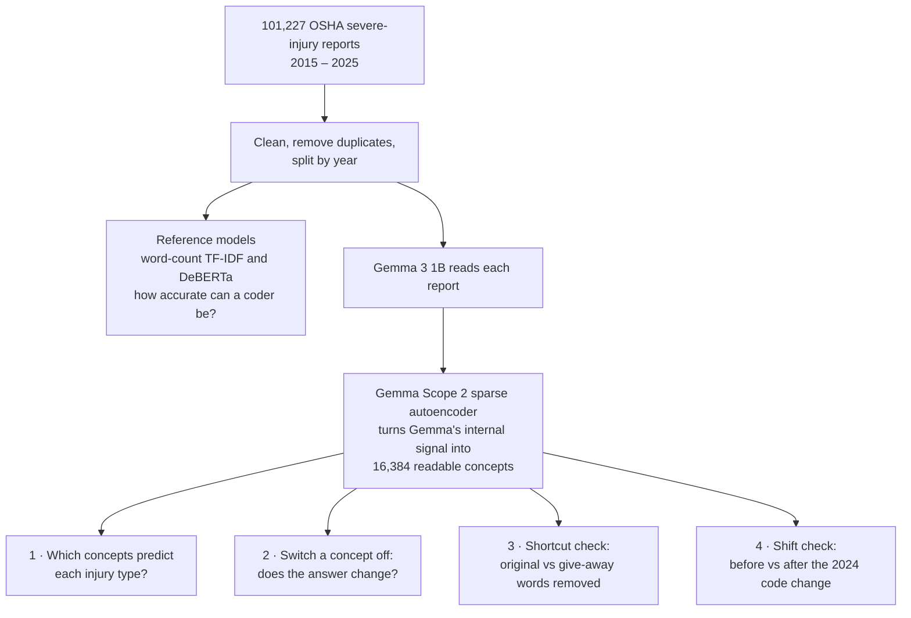
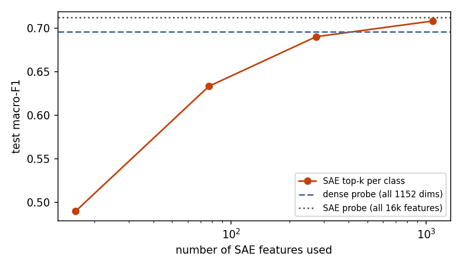
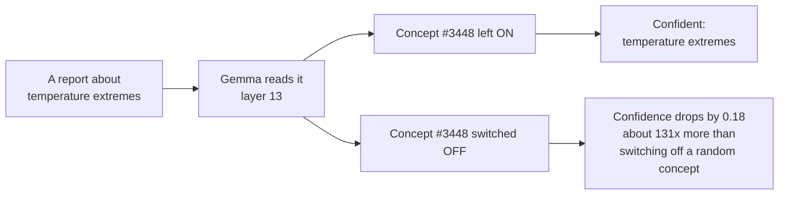
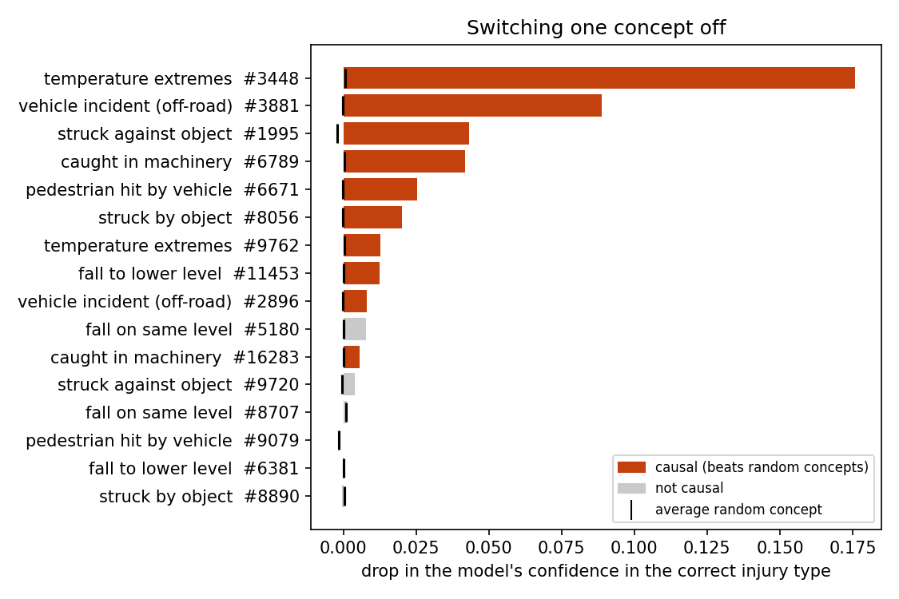
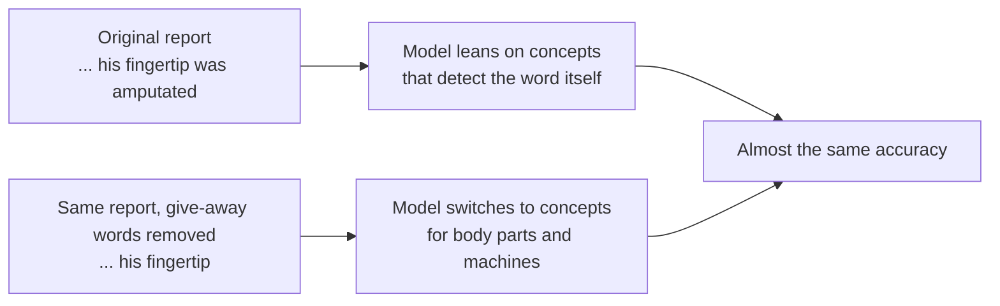
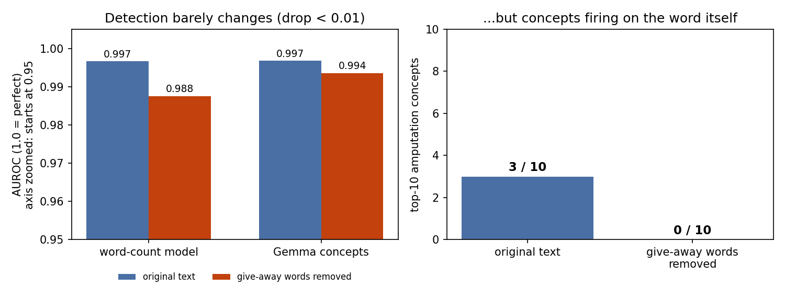
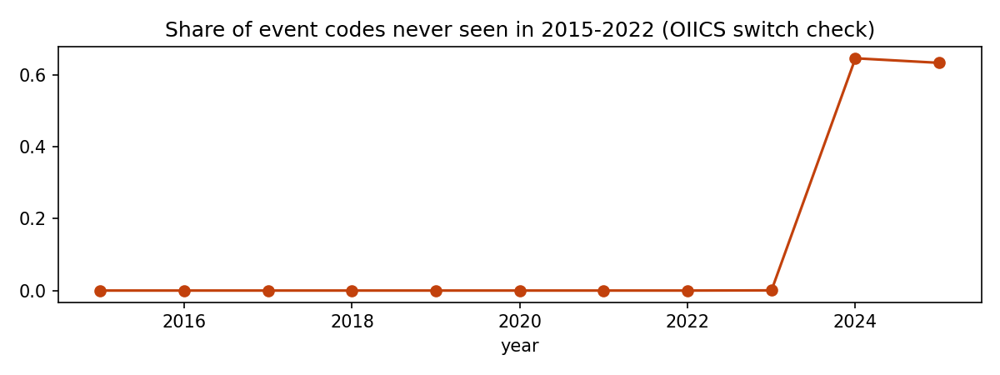
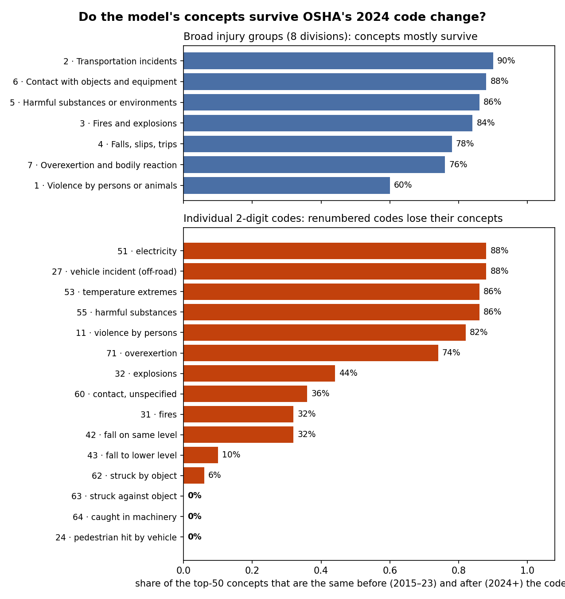

<h1 align="center">SPECTRA</h1>
<p align="center"><b>What does an AI actually look at when it reads a workplace-injury report?</b><br/>
<sub>Sparse Probing · Explanation · Causal Testing · Robustness Audit of AI injury coders</sub></p>

<p align="center">
<a href="LICENSE"></a>

<a href="https://colab.research.google.com/github/simarsinghlamba/spectra-osha/blob/main/notebooks/00_quickstart.ipynb"></a>
</p>

## The story in 60 seconds
Every day in the US, workers lose fingers in machines, fall from ladders or collapse in the heat. Employers must report
each severe injury to **OSHA** (the US workplace-safety agency) within 24 hours, in a few sentences. Each report then gets
an official code for **how** the injury happened: a fall, struck by an object, caught in a machine. More and more,
**AI models assign these codes.**

But it is hard to tell **what those models rely on**. Do they understand the hazard (the press brake, the ladder, the
heat)? Or do they take a shortcut by spotting a word that gives the answer away, like *"amputated"*?

**SPECTRA opens up an AI model while it reads 101,227 real OSHA reports**, translates what happens inside it into
thousands of human-readable *concepts*, and tests which concepts it really uses.

> **In one line:** the model can do the job from real hazard concepts, but it grabs a give-away word whenever one is
> there, and when OSHA renumbered its codes in 2024, the concepts behind several codes stopped lining up.

## Why it matters
- Safety agencies, insurers and companies use auto-coded injury data to decide **where to inspect and what to fix**.
- A model that leans on give-away words **looks accurate on paper** but may fail on reports written differently.
- When coding rules change, an AI coder **does not crash**. It keeps answering in the old language, so errors are silent.

## How it works


1. **Prepare the data.** 101,227 reports, duplicates removed, split by year: learn from 2015–2021, test on 2023, and test
   again on 2024–2025 (after OSHA's code change). A second copy has the give-away words (amputated, hospitalized, ...) removed.
2. **Set the bar.** Two ordinary classifiers show how accurate an injury coder can be: a word-count model (TF-IDF) and a
   fine-tuned transformer (DeBERTa).
3. **Look inside an AI.** Google's **Gemma 3 1B** reads every report. Google DeepMind's **Gemma Scope 2** works like a prism:
   it splits Gemma's dense internal signal into **16,384 separate concepts**, many of which mean something to a human
   ("ladder", "extreme heat", "the word *amputated*").
4. **Test the concepts.** Which ones predict each injury type? Does switching one off change the answer? Do they change
   when give-away words are removed? Do they survive the 2024 code change?

<details><summary><b>Key terms in plain words</b> (click to open)</summary>

| Term | Plain meaning |
|---|---|
| OIICS code | OSHA's official label for *how* an injury happened. We use 2 digits, e.g. 43 = fall to a lower level. |
| Gemma 3 1B | A small open AI language model from Google: the "reader" we study. |
| Concept (SAE feature) | A pattern inside Gemma that switches on for one idea. Gemma Scope 2 provides 16,384 of them. |
| Probe | A simple classifier trained on Gemma's insides: "is this information in there?" |
| Switch-off test (ablation) | Turn one concept off and see if the answer changes. Proves the model *uses* it. |
| Shortcut / leakage | A word in the text that gives the answer away, like "amputated". |
| Shift | Data changing over time; here, OSHA's 2024 code renumbering. |
| Macro-F1, AUROC | Scores from 0 to 1, higher is better. Macro-F1 counts rare injury types as much as common ones. |
</details>

## What we found

### 1. A few hundred concepts do most of the work
Out of 16,384 concepts, just **273 (1.7%)** identify the injury type almost as well
as Gemma's full internal signal (macro-F1 0.690 vs 0.696).
Reading Gemma through its concepts is as accurate as a classic word-count model
(0.713 vs 0.712).

<p align="center"></p>

### 2. The model really uses them
A concept can go along with an injury type without the model using it. So we **switch concepts off** and compare with
switching off random ones. **10 of 16** tested concepts pass. The strongest, the top
concept for **temperature extremes**, drops the model's confidence by **0.18**, about **131x** more than a
random concept.



<p align="center"></p>

<details><summary>Where does that concept fire? (two real reports; the bold word is where it is strongest)</summary>

> , causing a blockage. The employee was splashed with **hot**  water causing burns to the neck, torso, and
>
> process water when they stepped in an open hole containing **hot**  process water, resulting in second-degree burns to
</details>

### 3. It takes a shortcut when one is offered
**96%** of amputation reports literally contain "amputat...". Remove those words and
accuracy barely moves (AUROC 0.997 → 0.994); body-part and machine words are
enough. But inside the model, **3 of the 10** concepts it relies on most for amputation are detectors for the
give-away word itself. Remove the words and that falls to **0 of 10**, and only 2 of 10 concepts stay the same.
**Same score, different route.**



<p align="center"></p>

### 4. In 2024 the codes changed meaning, silently
In 2024 OSHA switched coding systems (OIICS 2 → 3). Many numbers stayed but **their meanings moved**: code 43 used to
mean *Other fall to lower level, unspecified*; now it means *Fall on same level due to slip or trip*. The share of
never-before-seen codes jumps from about 0% to **65%** in 2024.

<p align="center"></p>

A model trained before 2024 keeps answering in the old language. Broad injury groups (falls, contact with objects, ...)
hold up: **84%** of their top concepts are the same before and after. Individual codes do not:
**36%** on average, and **0%** for codes 24, 63, 64. All models lose
3.6–6.2 points on 2024+ reports.

<p align="center"></p>

### 5. How accurate is it overall?
The best model (DeBERTa) codes 2023 reports with **88% accuracy**
(macro-F1 0.728). That is significantly better than word counting
(McNemar p < 0.001), but only by a small margin on rare injury types.

<details><summary>Full results table</summary>

| Model | Event macro-F1, 2023 [95% CI] | Accuracy, 2023 | Group macro-F1, 2023 | Group macro-F1, 2024+ |
|---|---|---|---|---|
| M1 DeBERTa-v3 | 0.728 [0.717–0.738] | 0.877 | 0.812 | 0.775 |
| B1 TF-IDF+LR | 0.712 [0.698–0.726] | 0.831 | 0.807 | 0.762 |
| P-SAE L13 | 0.713 [0.697–0.726] | 0.834 | 0.821 | 0.760 |
| P-dense L13 | 0.696 [0.681–0.712] | 0.828 | 0.794 | 0.746 |
| P-SAE L17 | 0.708 [0.693–0.722] | 0.829 | 0.816 | 0.768 |
| P-dense L17 | 0.696 [0.682–0.710] | 0.829 | 0.783 | 0.745 |

*Event* = 19 injury types (2-digit codes); *Group* = 8 broad divisions, used for 2024+ because the 2-digit codes were
renumbered. Data: train 40,000 (2015–21), test 8,762 (2023), after-change 17,527 (2024–Nov 2025).
Every number is in [`results/tables/`](results/tables).
</details>

## Run it yourself
Everything runs on **free Google Colab**. Click the badge to open the quickstart, run it, then follow its step list.

[](https://colab.research.google.com/github/simarsinghlamba/spectra-osha/blob/main/notebooks/00_quickstart.ipynb)

<details><summary>All notebooks, in order</summary>

| Notebook | What it does | Runtime | Time |
|---|---|---|---|
| [Open `00_quickstart.ipynb`](https://colab.research.google.com/github/simarsinghlamba/spectra-osha/blob/main/notebooks/00_quickstart.ipynb) | Copy the project to your Drive, download + verify the data (**start here**) | CPU | ~5 min |
| [Open `01_clean_split.ipynb`](https://colab.research.google.com/github/simarsinghlamba/spectra-osha/blob/main/notebooks/01_clean_split.ipynb) | Clean, dedupe, remove give-away words, split by year | CPU | ~15 min |
| [Open `02_baselines.ipynb`](https://colab.research.google.com/github/simarsinghlamba/spectra-osha/blob/main/notebooks/02_baselines.ipynb) | Word-count (TF-IDF) baseline; shortcut test | CPU | ~10 min |
| [Open `03_deberta.ipynb`](https://colab.research.google.com/github/simarsinghlamba/spectra-osha/blob/main/notebooks/03_deberta.ipynb) | DeBERTa reference model | T4 GPU | ~25 min |
| [Open `04_gemma_sae.ipynb`](https://colab.research.google.com/github/simarsinghlamba/spectra-osha/blob/main/notebooks/04_gemma_sae.ipynb) | Gemma 3 1B + Gemma Scope 2 concepts | T4 GPU | ~80 min |
| [Open `05_probes.ipynb`](https://colab.research.google.com/github/simarsinghlamba/spectra-osha/blob/main/notebooks/05_probes.ipynb) | Concept probes; how few concepts are needed | CPU | ~45 min |
| [Open `06_concepts_ablation.ipynb`](https://colab.research.google.com/github/simarsinghlamba/spectra-osha/blob/main/notebooks/06_concepts_ablation.ipynb) | Concept discovery and switch-off tests | T4 GPU | ~60 min |
| [Open `07_shift_stats_errors.ipynb`](https://colab.research.google.com/github/simarsinghlamba/spectra-osha/blob/main/notebooks/07_shift_stats_errors.ipynb) | Statistics, 2024 shift, subgroups | CPU | ~10 min |

Notebooks 04 and 06 need a free Hugging Face token (Colab secret `HF_TOKEN`) after accepting the
[Gemma licence](https://huggingface.co/google/gemma-3-1b-pt). Package versions: [`requirements.txt`](requirements.txt).
Checks: `python -m pytest -q tests`. Only want to verify numbers? Read `results/tables/`; nothing needs rerunning.
</details>

## What's in this repo
```
spectra/     shared Python code: settings, data cleaning, Gemma reader, concept loader, statistics
notebooks/   one Colab notebook per stage (00_quickstart first)
scripts/     the same stages as plain Python files
results/     every number (tables/*.csv) and every chart (figures/*.png) in this README
tests/       automatic checks on the data (no leaks between years, no private columns, ...)
data/        how to download the OSHA data (the data itself is not stored here)
```

## Limits (honest)
- Concept-based probes are not expected to beat strong classifiers (Kantamneni et al., ICML 2025). SPECTRA uses them to
  **discover and audit**, not to win a leaderboard.
- One model (Gemma 3 1B), one main layer, one dictionary size. Concept names are human interpretations.
- Give-away words are removed with rules; a few faint traces remain (e.g. "had to").
- Each switch-off test is compared with 50 random concepts, so the smallest possible p-value is about 0.02.
- Reports are written by employers and cover federal-OSHA states only.

## Responsible use
For research and to support human injury coders only, not for enforcement, ranking employers or individual claims.
Employer names, addresses and locations are never published.

## Credits, licences, citation
Data: US Department of Labor / OSHA Severe Injury Reports (public domain; no endorsement implied).
Gemma 3: Gemma Terms of Use. Gemma Scope 2: Google DeepMind (CC-BY-4.0). DeBERTa-v3: Microsoft (MIT).
Code: MIT. To cite, see [`CITATION.cff`](CITATION.cff).

**Coming next:** an interactive demo, the cleaned dataset and the trained model on Hugging Face.

<p align="center">Made by <b>Simar Singh Lamba</b> · <a href="https://github.com/simarsinghlamba">github.com/simarsinghlamba</a></p>
